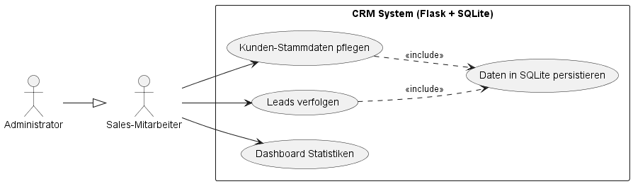
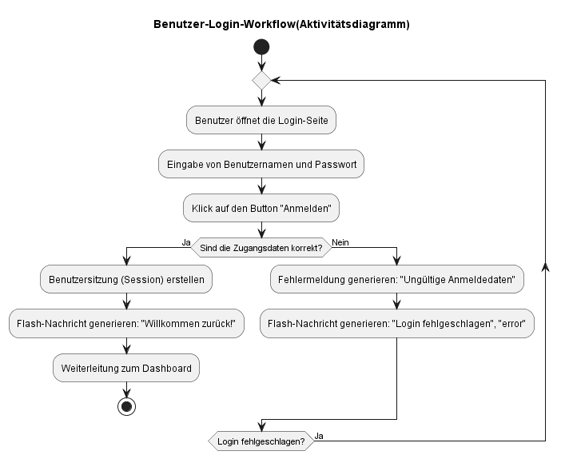
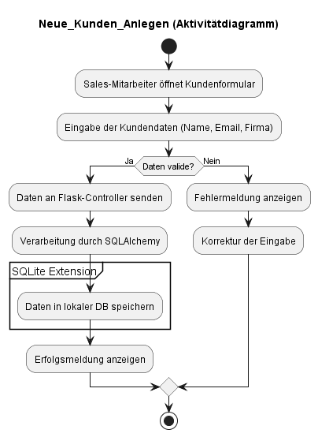
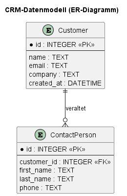
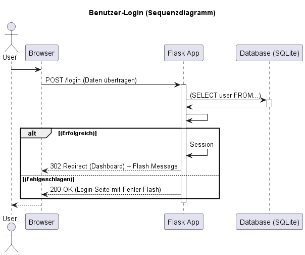
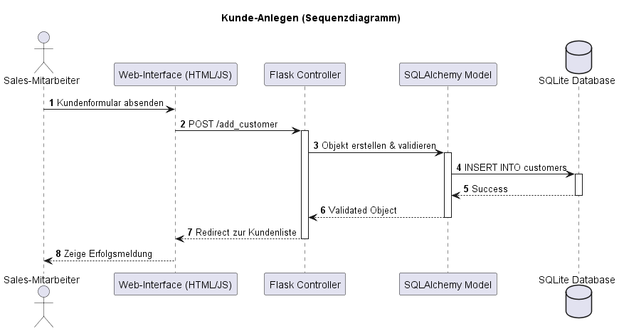
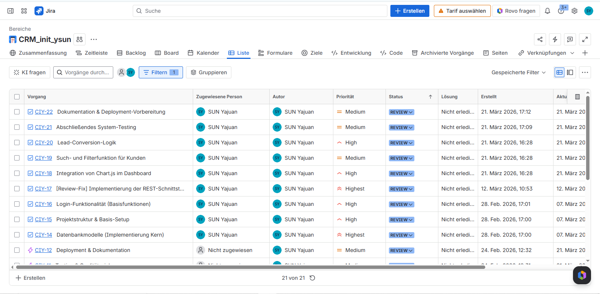

# CRM-Vertriebssystem - Projektberichterstattung (M4)

##  Projektbeschreibung
Dieses CRM-System wurde zur digitalen Verwaltung von Kunden und Verkaufsinteressenten (Leads) entwickelt. Das Projekt umfasst den gesamten Lebenszyklus von der Anforderungsanalyse über die Implementierung einer sicheren Web-Anwendung bis hin zur automatisierten API-Dokumentation.

##  Projektverlauf (Sprint-Historie)

| Sprint | Zeitraum | Fokus | Deliverables (Ergebnisse) |
| :--- | :--- | :--- | :--- |
| **Sprint 0** | Woche 1 | Setup & Planning | Jira-Setup, Github Repo Initialisierung, Erweiterung festgelegt |
| **Sprint 1** | Woche 2 | Requirements & Design | Use-Case, Activity Diagrams, ERD, Sequence Diagrams |
| **Sprint 2** | Woche 3 | Kern-Implementierung | CRUD-Funktionen, Authentifizierung, API-Grundgerüst |
| **Sprint 3** | Woche 4 | Finalisierung & RBAC | Dashboard (Charts), RBAC-System, Lead-Konvertierung, API-Docs |

##  Benutzerrollen & Test-Accounts
Für die Evaluierung des RBAC-Systems (Role-Based Access Control) wurden folgende Accounts angelegt:

| Rolle | Benutzername | Passwort | Berechtigungen |
| :--- | :--- | :--- | :--- |
| **Administrator** | admin | password123 | Voller Zugriff (CRUD, Löschen, Lead-Konvertierung) |
| **Standard-User** | user1 | user123 | Eingeschränkter Zugriff (Anzeige, Suche, Filterung) |

##  Dokumentation & UML-Diagramme
Sämtliche Diagramme befinden sich im Ordner `docs/` und dokumentieren die Architektur des Systems:

### 1. Prozess- & Anwendungsmodellierung
- **Use-Case-Diagramm**: 
- **Aktivitätsdiagramm (Login)**: 
- **Aktivitätsdiagramm (Kunden)**: 

### 2. Daten- & Interaktionsmodellierung
- **Datenmodell (ERD)**: 
- **Sequenzdiagramm (Login)**: 
- **Sequenzdiagramm (Kunden)**: 

### 3. Projekt-Management
- **Jira-Abschlussstatus**: 

##  Installation & Ausführung
1. Abhängigkeiten installieren: `pip install -r requirements.txt`
2. Anwendung starten: `python app.py`
3. Swagger API-Dokumentation: [http://127.0.0.1:5000/apidocs](http://127.0.0.1:5000/apidocs)

---
*Status: Finaler Release (M4) - März 2026*